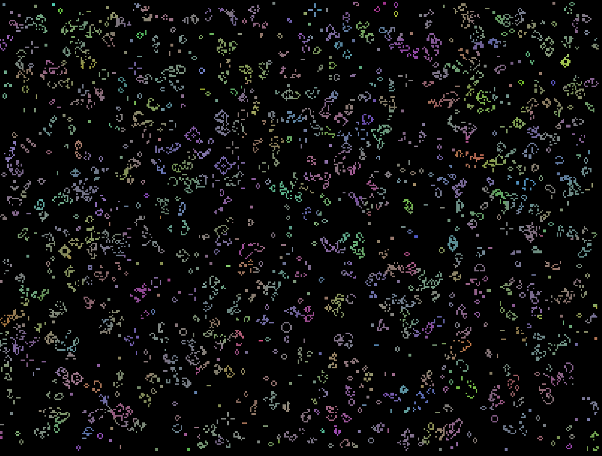
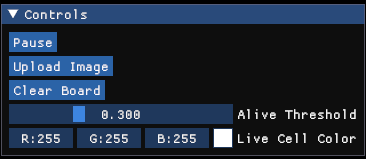
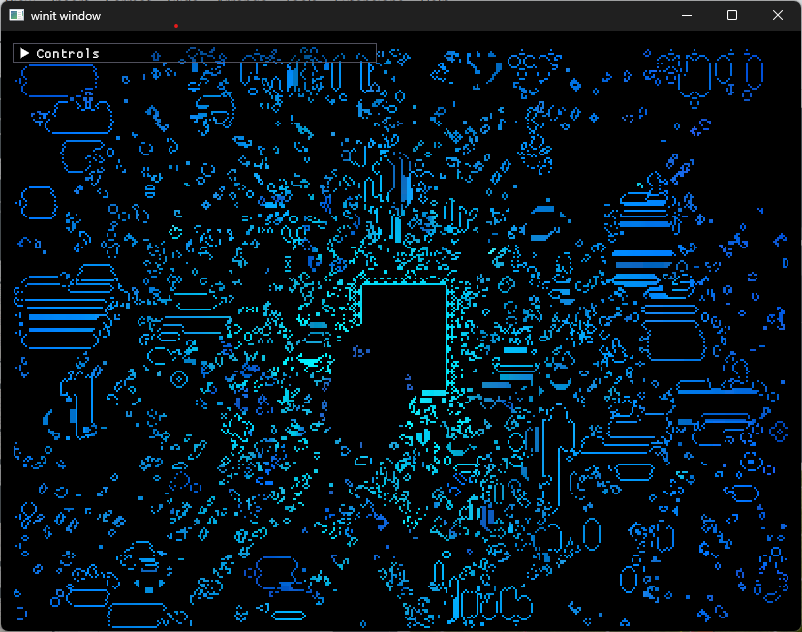
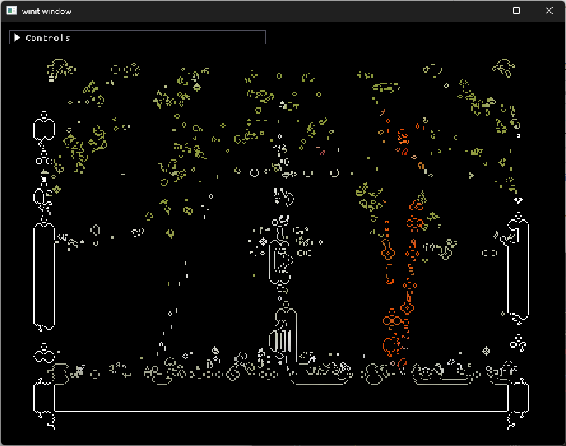
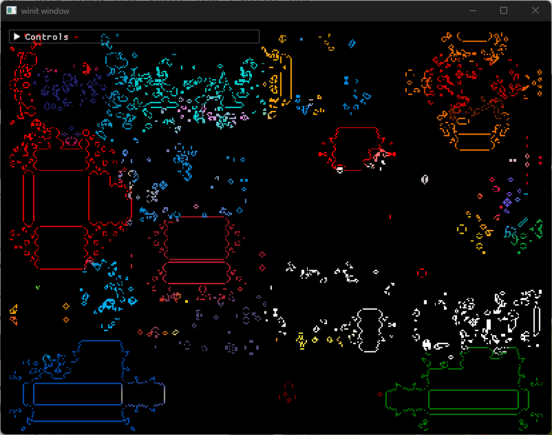
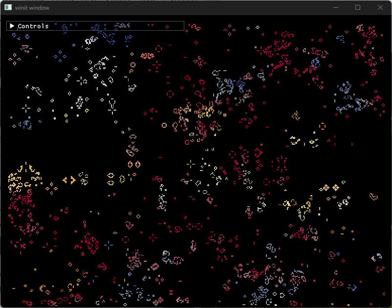
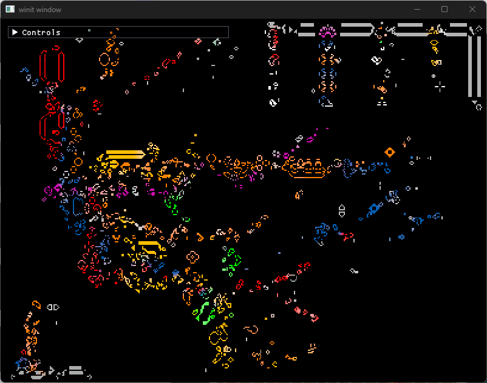

# ferrolife



## Build and Run

### Desktop

Run in debug mode:

```bash
cargo run
```

Build debug binaries:

```bash
cargo build
```

Build optimized release binaries:

```bash
cargo build --release
```

### WebAssembly (optional)

Build for `wasm32-unknown-unknown`:

```bash
rustup target add wasm32-unknown-unknown
cargo build --target wasm32-unknown-unknown
```

If you use `wasm-pack`, you can also run:

```bash
wasm-pack build --target web
```

## Keyboard Controls

These controls are currently implemented in the app.

| Key(s)                  | Action                                   |
| ----------------------- | ---------------------------------------- |
| `W` / `Arrow Up`        | Pan camera up                            |
| `A` / `Arrow Left`      | Pan camera left                          |
| `S` / `Arrow Down`      | Pan camera down                          |
| `D` / `Arrow Right`     | Pan camera right                         |
| `Shift` + movement keys | Increase camera pan speed while held     |
| `E`                     | Zoom in                                  |
| `Q`                     | Zoom out                                 |
| `Space`                 | Pause or resume simulation               |
| `Esc`                   | Exit application                         |
| `U`                     | Open file picker and load an image board |

## UI Controls



Open the control panel in the top-left corner.

| Control                  | Action                                                            |
| ------------------------ | ----------------------------------------------------------------- |
| `Pause/Resume`           | Toggle simulation playback                                        |
| `Upload Image`           | Open file picker and load image as initial board                  |
| `Clear Board`            | Set all cells to black                                            |
| `Alive Threshold` slider | Set alive detection threshold (`0.0` to `1.0`, default `0.3`)     |
| `Live Cell Color` picker | Choose the paint color used when activating cells (default white) |

### Mouse Interaction

| Input      | Action                                                          |
| ---------- | --------------------------------------------------------------- |
| Left click | Set the clicked cell alive using the selected `Live Cell Color` |

## Gallery






